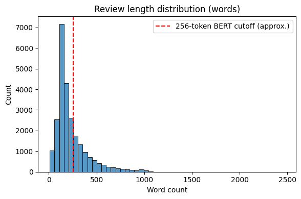
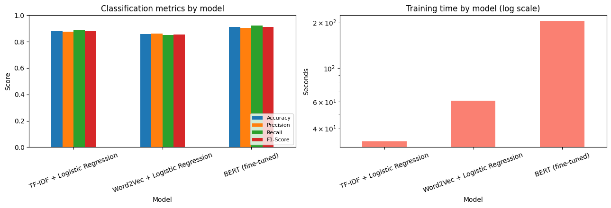
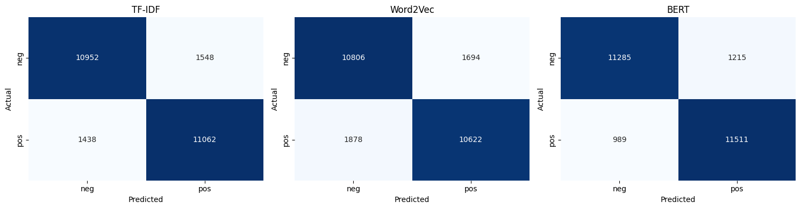

# Sentiment Analysis on IMDB Movie Reviews: TF-IDF vs. Word2Vec vs. BERT


[](LICENSE)
[](https://colab.research.google.com/github/farjanaferdausi-cs50ai/imdb-sentiment-analysis/blob/main/imdb_sentiment_analysis.ipynb)

A controlled, head-to-head comparison of three text representation techniques for binary sentiment classification, evaluated on 25,000 held-out IMDB movie reviews under a single, leakage-free experimental design.

## Overview

This project implements and compares three approaches to sentiment classification:

1. **TF-IDF** (unigrams + bigrams) → Logistic Regression
2. **Word2Vec** (skip-gram, averaged embeddings) → Logistic Regression
3. **BERT** (`bert-base-uncased`, fine-tuned) → sequence classification head

All three models are trained under a consistent, stratified train/validation/test split with fixed random seeds, and evaluated on the exact same held-out test set, isolating representation quality as the primary variable under comparison.

## Dataset

- **Source:** [IMDB Movie Reviews](https://huggingface.co/datasets/stanfordnlp/imdb), loaded via the Hugging Face `datasets` library
- **Size:** 50,000 reviews (25,000 train / 25,000 test), perfectly balanced between positive and negative sentiment
- **Split used:** 20,000 train / 5,000 validation (stratified from the official train split) / 25,000 test (held out, untouched until final evaluation)



## Methodology

- **Leakage-free splitting** — every vectorizer and embedding model is fit only on the training data, never on validation or test text.
- **Controlled comparison** — the same Logistic Regression classifier is used for both TF-IDF and Word2Vec, isolating representation quality as the variable under test.
- **Dual preprocessing pipelines** — a "heavy" pipeline (lowercase, strip HTML, strip punctuation, remove stopwords) for TF-IDF/Word2Vec, and a "light" pipeline (strip HTML only) for BERT, since BERT's self-attention is pretrained to use casing and function words as context.
- **Efficiency trade-off** — BERT is fine-tuned on a stratified 8,000-review subsample (configurable in the notebook) to keep training practical on a single Colab GPU session, but is evaluated on the full 25,000-review test set, identically to the other two models.
- **Reproducibility** — a fixed random seed (42) is used across NumPy, scikit-learn, gensim, and PyTorch.

## Results

| Model | Accuracy | Precision | Recall | F1-Score | Train Time |
|---|---|---|---|---|---|
| TF-IDF + Logistic Regression | 88.06% | 87.72% | 88.50% | 88.11% | ~33s |
| Word2Vec + Logistic Regression | 85.71% | 86.25% | 84.98% | 85.61% | ~61s |
| **BERT (fine-tuned)** | **91.18%** | 90.45% | 92.09% | **91.26%** | ~204s |





**Key finding:** BERT achieves the strongest performance across every metric, consistent with its ability to model word order and context through self-attention. Somewhat counterintuitively, averaged Word2Vec did not outperform TF-IDF — likely because naive mean-pooling discards word order and dilutes sentiment-bearing words with neutral ones. Representation power and computational cost scale together, but not linearly: BERT's accuracy gain comes at a training cost per example roughly an order of magnitude higher than TF-IDF's.

## Tech Stack

`Python` · `scikit-learn` · `gensim` · `PyTorch` · `Hugging Face Transformers` & `Datasets` · `pandas` · `NumPy` · `Matplotlib` / `Seaborn`

## Repository Structure

```
├── imdb_sentiment_analysis.ipynb   # Full notebook: data loading, preprocessing,
│                                   # all three models, evaluation, and analysis
├── images/                         # Charts referenced in this README
├── requirements.txt                # Python dependencies
├── .gitignore
├── LICENSE
└── README.md
```

## How to Run

1. Open the notebook in Google Colab (or use the "Open in Colab" badge above)
2. `Runtime → Change runtime type → T4 GPU` (required for the BERT section)
3. `Runtime → Run all`

## Author

**Farjana Ferdausi**

AI Engineering Fellow, Google Cloud Gen AI Academy · 

GitHub repo: https://github.com/farjanaferdausi-cs50ai
LinkedIn Link: www.linkedin.com/in/farjana-ferdausi  
Medium Link: https://medium.com/@farjana.rafi1983
*Built as part of the Ostad AI/ML Engineering Program (Batch 6).*

